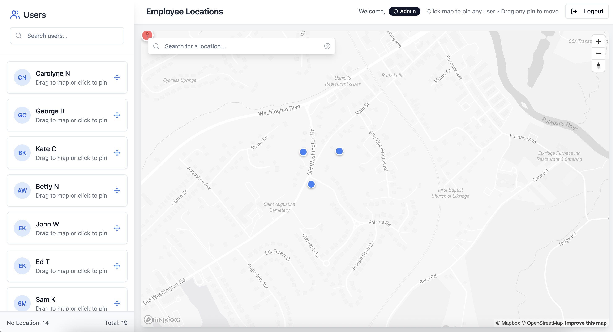

# Employees Map

This app allows you to create a geographical overview of user locations. These locations can be general or specific. This is manually updated and does not utilize any device locations.
Admin can update everyone's location. Users can only update their own. 

Currently implemented using n8n webhooks as endpoints which in turn interacts with records from Teable.
You need: 
- Login endpoint that receives email/password (POST)
- Users endpoint that gets users (id, email, name, coordinates) (GET)
- Update endpoint to update cordinates using user id (POST)

> 💡 You can modify this to map anything else besides users!



## Setup

```bash
npm i
cp .env.example .env
npm run dev
```

### Required Variables

- `VITE_MAPBOX_ACCESS_TOKEN`: Your Mapbox access token (get one from [Mapbox](https://account.mapbox.com/access-tokens/))
- `VITE_API_AUTH_TOKEN`: Authorization token for API requests (Bearer token) - **Required for authentication**

### Optional Variables

- `VITE_APP_NAME`: Application name (default: "Employees Map")
- `VITE_APP_VERSION`: Application version (default: "1.0.0")
- `VITE_DEFAULT_MAP_CENTER_LNG`: Default map longitude (default: 36.8219 - Nairobi)
- `VITE_DEFAULT_MAP_CENTER_LAT`: Default map latitude (default: -1.2921 - Nairobi)
- `VITE_DEFAULT_MAP_ZOOM`: Default map zoom level (default: 10)
- `VITE_MAP_STYLE`: Default Mapbox map style (user can change it via UI settings)
  - Options include: streets-v11, light-v11, dark-v11, satellite-v9, satellite-streets-v11, navigation-day-v1, navigation-night-v1
- `VITE_DEBUG_MODE`: Enable debug mode (default: true in development)
- `VITE_LOG_LEVEL`: Logging level (default: "debug")
- `VITE_ADMIN_EMAILS`: Comma-separated list of admin email addresses (can move any pin)

### API Configuration

- `VITE_API_BASE_URL`: Base URL for API endpoints
- `VITE_LOCATION_TRACKER_ENDPOINT`: Location tracker endpoint path
- `VITE_USERS_ENDPOINT`: Users endpoint path
- `VITE_LOGIN_ENDPOINT`: Login endpoint path for authentication

## Authentication & Permissions

The application uses **email and password authentication** with role-based permissions:

### Login

- Users must provide both **email** and **password** to log in
- Authentication uses POST request to dedicated login endpoint (`VITE_LOGIN_ENDPOINT`)
- Login credentials are sent securely to the server for validation
- Sessions are persisted in localStorage for convenience
- Fallback authentication is available if API is temporarily unavailable

### Permission Levels

The app has two levels of access for pin management:

1. **Admin Users**: Can create and manage pins for any user
   - Configured via `VITE_ADMIN_EMAILS` environment variable
   - Comma-separated list of email addresses
   - Example: `admin@company.com,manager@company.com`
   - Can create pins for any user when clicking the map
   - Can drag any user's pin to move their location
   - Can delete any user's pin

2. **Regular Users**: Can only manage their own pin
   - Can only pin their own location
   - When clicking the map, dialog opens directly for their user
   - Can only move their own pin
   - Can only delete their own pin
   - Cannot see or select other users for pinning
   - Can only drag their own pin to move their location
   - Other pins appear locked with reduced opacity
   
   **Admin users** can drag any existing pin to a new location and have visual indicators showing their admin status

### User Interface

- **Admin Badge**: Shows in the header for admin users
- **Pin Colors**: Blue for pinned locations, green for auto-located
- **Pin Status**: Tooltips and popups show lock/unlock status
- **Permission Text**: Header shows current user's capabilities

### Security Features

- **No Password Required for Pinning**: Users are already authenticated, so no additional password verification is needed for pin operations
- **Secure Logging**: Console logs that could leak sensitive user data, coordinates, or authentication information have been removed from production code
- **Permission-Based Access**: All pin creation and movement operations are validated based on user permissions
- **Session Management**: User sessions are securely managed with proper validation

## Features

### Map Features

1. **User Location Pins**: Displays all user locations on an interactive map
2. **Real-time Updates**: Pins are updated in real-time when moved or added
3. **Info Popups**: Click pins to view detailed user information
4. **Map Search**: Search for locations to easily navigate the map
5. **Map Style Switcher**: Change map styles with a single click
   - Access via the gear icon in the header
   - Choose from multiple Mapbox styles: Streets, Light, Dark, Satellite, etc.
   - Style preferences are saved to localStorage
6. **Responsive Design**: Works on desktop and mobile devices

### Pin Movement Permissions

1. **Admin Users**: Can move any pin on the map
   - Visual indicators show admin status
   - Can drag any existing pin to a new location

2. **Regular Users**: Can only move their own pin
   - Other pins appear locked with reduced opacity
   - Can only drag their own pin to move their location
