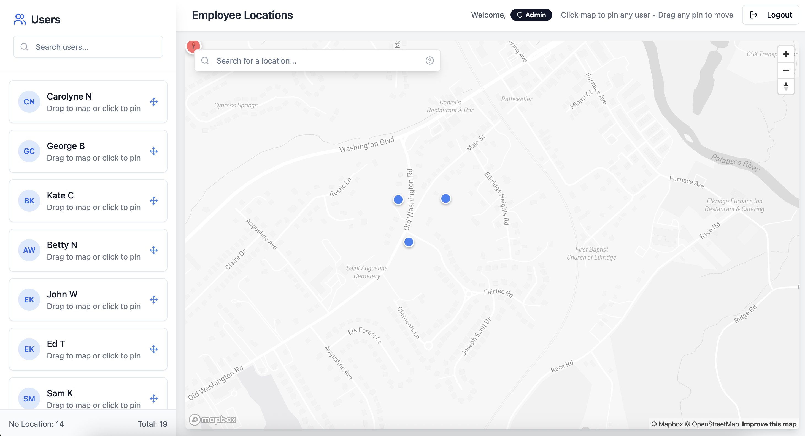

# TeamTerrain - Employee Location Management

A full-stack application for visualizing and managing employee locations on an interactive map. Built with React (frontend) and Node.js (backend) with SQLite database.



## Features

- 🗺️ **Interactive Map**: Powered by Mapbox with multiple map styles
- 👥 **User Management**: View and manage employee locations
- 🔐 **Authentication**: Secure login with JWT tokens
- 📍 **Location Management**: Update and manage employee locations with history
- 📱 **Responsive Design**: Works on desktop and mobile devices
- 🔒 **Role-based Access**: Admin and user permission levels
- 🌍 **Global Support**: Works with locations worldwide

## Architecture

- **Frontend**: React + TypeScript + Vite + Mapbox GL JS
- **Backend**: Node.js + Express + SQLite + JWT Auth
- **Database**: SQLite with automatic migrations
- **Deployment**: Cloudflare Pages (frontend) + Node.js hosting (backend)

## Quick Start

### Prerequisites

- Node.js 18+
- Bun (recommended) or npm
- [Mapbox API token](https://account.mapbox.com/access-tokens/)

### Running Both Applications

1. **Clone and setup**:
   ```bash
   git clone <repository-url>
   cd teamterrain
   ```

2. **Start Backend** (Terminal 1):
   ```bash
   cd backend
   npm install
   cp .env.example .env
   # Edit .env with your configuration
   npm run db:migrate
   npm run db:seed
   npm start
   ```
   Backend runs on `http://localhost:3001`

3. **Start Frontend** (Terminal 2):
   ```bash
   cd frontend
   bun install
   # Edit .env with your Mapbox token
   bun run dev
   ```
   Frontend runs on `http://localhost:5173`

4. **Access Application**: Open `http://localhost:5173`

### Test Accounts

- **Admin**: `admin@teamterrain.com` / `admin123`
- **Users**: `john.doe@teamterrain.com` / `password123` (and others)

## Documentation

For detailed setup and development instructions:

- **[Backend Documentation](./backend/README.md)** - API server setup, database, authentication
- **[Frontend Documentation](./frontend/README.md)** - React app setup, Mapbox configuration, UI features  
- **[Development Guide](./DEVELOPMENT.md)** - Full development workflow and troubleshooting

## Project Structure

```
Team Terrain/
├── backend/           # Node.js API server
│   ├── src/routes/    # API endpoints  
│   ├── src/database/  # SQLite database
│   └── README.md      # Backend documentation
├── frontend/          # React application
│   ├── src/components/# UI components
│   ├── src/hooks/     # React hooks
│   └── README.md      # Frontend documentation
└── DEVELOPMENT.md     # Development guide
```

## Environment Setup

Both applications require environment configuration:

- **Backend**: Copy `backend/.env.example` → `backend/.env`
- **Frontend**: Copy `frontend/.env.example` → `frontend/.env`

Key variables:
- `VITE_MAPBOX_ACCESS_TOKEN` - Your Mapbox API token
- `API_AUTH_TOKEN` - Must match between frontend and backend
- `JWT_SECRET` - Backend JWT signing secret

## Deployment

### Production Checklist

- [ ] Set strong `JWT_SECRET` and `API_AUTH_TOKEN`
- [ ] Configure production database (PostgreSQL recommended)
- [ ] Set up CORS for production domains
- [ ] Deploy backend to Node.js hosting service
- [ ] Deploy frontend to static hosting (Cloudflare Pages included)
- [ ] Update environment variables for production

See individual README files for deployment details.

## Contributing

1. Fork the repository
2. Create a feature branch
3. Follow the development guide
4. Test both frontend and backend
5. Submit a pull request

## Support

- **Issues**: Check individual README files first
- **Backend Help**: See [backend/README.md](./backend/README.md)
- **Frontend Help**: See [frontend/README.md](./frontend/README.md)
- **Development**: See [DEVELOPMENT.md](./DEVELOPMENT.md)

4. **Open your browser**: Visit `http://localhost:5173`

5. **Login**: Use `admin@teamterrain.com` / `admin123` or any test user

## Project Structure

```
teamterrain/
├── backend/           # Node.js API server
│   ├── src/
│   │   ├── routes/    # API endpoints
│   │   ├── database/  # SQLite database
│   │   └── middleware/# Auth, validation
│   └── README.md
├── frontend/          # React application
│   ├── src/
│   │   ├── components/
│   │   ├── hooks/
│   │   └── lib/
│   └── README.md
└── DEVELOPMENT.md     # Development guide
```

## Technology Stack

### Backend
- **Node.js** with Express.js
- **SQLite** database
- **JWT** authentication
- **bcryptjs** for password hashing
- **Joi** for validation

### Frontend
- **React** with TypeScript
- **Vite** for build tooling
- **Mapbox GL JS** for mapping
- **shadcn/ui** for components
- **Tailwind CSS** for styling

## Environment Configuration

### Backend (.env)
```env
PORT=3001
JWT_SECRET=your-secret-key
API_AUTH_TOKEN=your-api-token
DATABASE_PATH=./database.sqlite
CORS_ORIGIN=http://localhost:5173
```

### Frontend (.env)
```env
VITE_MAPBOX_ACCESS_TOKEN=your-mapbox-token
VITE_API_BASE_URL=http://localhost:3001/api
VITE_API_AUTH_TOKEN=your-api-token
```

## API Endpoints

- `POST /api/auth/login` - User authentication
- `GET /api/users` - Get all users
- `PUT /api/users/user/:id` - Update user
- `POST /api/location/update` - Update location
- `GET /api/location/history/:userId` - Location history

## Default Test Accounts

- **Admin**: `admin@teamterrain.com` / `admin123`
- **Test Users**: Various international locations with `password123`

## Deployment

### Backend
- Deploy to any Node.js hosting (Heroku, Railway, DigitalOcean)
- Set production environment variables
- Use PostgreSQL for production database

### Frontend
- Deploy to Cloudflare Pages, Vercel, or Netlify
- GitHub Actions workflow included for Cloudflare Pages

## Development

See [DEVELOPMENT.md](DEVELOPMENT.md) for detailed development setup and workflow.

## Contributing

1. Fork the repository
2. Create a feature branch
3. Make your changes
4. Test thoroughly
5. Submit a pull request

## License

MIT License - see LICENSE file for details

## Support

For issues and questions:
- Check the [DEVELOPMENT.md](DEVELOPMENT.md) guide
- Review the backend [README](backend/README.md)
- Review the frontend [README](frontend/README.md)
